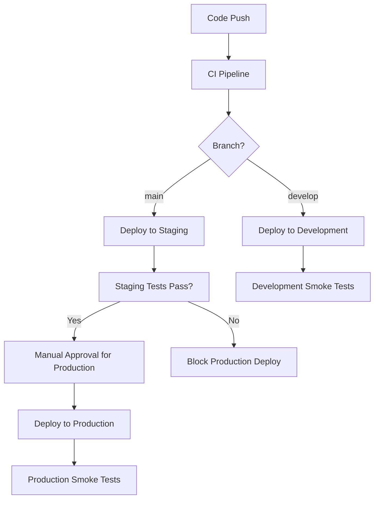

# CI/CD Strategy for IncomeMeter

## 🎯 Overview

This document outlines the comprehensive CI/CD (Continuous Integration/Continuous Deployment) strategy for the IncomeMeter application, a .NET 9 Web API with React frontend that provides income tracking for drivers.

## 🏗️ Architecture

### Technology Stack
- **Backend**: .NET 9 Web API with MongoDB
- **Frontend**: React 18 with TypeScript and Vite
- **Authentication**: Google OAuth 2.0
- **APIs**: OpenCage (geocoding), OpenRouteService (distance calculation)
- **Containerization**: Docker multi-stage builds
- **Cloud Platform**: Microsoft Azure (Container Apps)
- **CI/CD**: GitHub Actions

### Infrastructure Components
- **Azure Container Apps**: Serverless container hosting
- **Azure Key Vault**: Secrets management
- **Azure Application Insights**: Monitoring and logging
- **Azure Log Analytics**: Centralized logging
- **GitHub Container Registry**: Container image storage

## 🔄 CI/CD Pipeline Stages

### 1. Continuous Integration (CI)

#### **Code Quality Gates**
```yaml
# Triggered on: push to main/develop, pull requests
Stages:
├── Backend Testing (.NET 9)
│   ├── Restore dependencies
│   ├── Build solution
│   ├── Run unit tests
│   └── Publish test results
├── Frontend Testing (React/TypeScript)
│   ├── Install dependencies
│   ├── ESLint code analysis
│   ├── Unit tests with coverage
│   └── Upload coverage reports
└── Security Scanning
    ├── Trivy vulnerability scan
    └── Upload results to GitHub Security
```

#### **Build & Package**
```yaml
# Triggered on: successful CI tests
Stages:
├── Multi-stage Docker Build
│   ├── Build .NET API
│   ├── Build React frontend
│   ├── Create optimized runtime image
│   └── Push to GitHub Container Registry
└── Container Security Scan
    ├── Scan built image
    └── Sign container with Cosign (future)
```

### 2. Continuous Deployment (CD)

#### **Multi-Environment Strategy**

| Environment | Trigger | Purpose | Auto-Deploy |
|-------------|---------|---------|-------------|
| **Development** | `develop` branch push | Feature development & testing | ✅ Yes |
| **Staging** | `main` branch push | Pre-production validation | ✅ Yes |
| **Production** | Manual dispatch only | Live application | ❌ Manual approval |

#### **Deployment Flow**


## 🔒 Security & Secrets Management

### **Secret Categories**
1. **Database**: MongoDB connection strings
2. **Authentication**: Google OAuth credentials, JWT secrets
3. **APIs**: OpenCage, OpenRouteService API keys
4. **Monitoring**: Application Insights connection strings

### **Security Implementation**
```yaml
Security Layers:
├── GitHub Secrets (CI/CD variables)
├── Azure Key Vault (Runtime secrets)
├── Container Image Scanning
├── Network Security (Container Apps)
└── RBAC (Azure resources)
```

### **Key Vault Integration**
- **Development**: Local appsettings files (gitignored)
- **Staging/Production**: Azure Key Vault with managed identity
- **CI/CD**: GitHub encrypted secrets for deployment

## 🚀 Deployment Configurations

### **Environment-Specific Settings**

#### Development Environment
```yaml
Configuration:
  Replicas: 1
  CPU: 0.5 cores
  Memory: 1Gi
  Auto-scaling: 1-3 replicas
  URLs:
    Frontend: https://incomemeter-dev.azurewebsites.net
    API: https://incomemeter-api-dev.azurewebsites.net
```

#### Staging Environment
```yaml
Configuration:
  Replicas: 1
  CPU: 0.5 cores
  Memory: 1Gi
  Auto-scaling: 1-3 replicas
  URLs:
    Frontend: https://incomemeter-staging.azurewebsites.net
    API: https://incomemeter-api-staging.azurewebsites.net
```

#### Production Environment
```yaml
Configuration:
  Replicas: 2 (high availability)
  CPU: 1.0 cores
  Memory: 2Gi
  Auto-scaling: 2-10 replicas
  URLs:
    Frontend: https://incomemeter.com
    API: https://api.incomemeter.com
```

## 🐳 Container Strategy

### **Multi-Stage Dockerfile**
```dockerfile
# Stage 1: Build .NET API
FROM mcr.microsoft.com/dotnet/sdk:9.0 AS build-backend
# Build API components

# Stage 2: Build React Frontend
FROM node:18-alpine AS build-frontend
# Build frontend for production

# Stage 3: Runtime
FROM mcr.microsoft.com/dotnet/aspnet:9.0 AS runtime
# Combine API + static frontend files
# Non-root user for security
# Health checks configured
```

### **Container Benefits**
- **Consistency**: Same image across all environments
- **Security**: Non-root user, minimal attack surface
- **Performance**: Multi-stage builds reduce image size
- **Monitoring**: Built-in health checks

## 📊 Monitoring & Observability

### **Application Monitoring**
```yaml
Monitoring Stack:
├── Azure Application Insights
│   ├── Request tracking
│   ├── Dependency tracking
│   ├── Exception monitoring
│   └── Custom telemetry
├── Structured Logging (Serilog)
│   ├── Request correlation IDs
│   ├── Security event logging
│   ├── Performance metrics
│   └── Business logic tracking
└── Health Checks
    ├── Database connectivity
    ├── External API availability
    └── Application readiness
```

### **Key Metrics**
- **Performance**: Response times, throughput
- **Reliability**: Error rates, availability
- **Security**: Authentication events, failed attempts
- **Business**: User registrations, route tracking

## 🧪 Testing Strategy

### **Test Pyramid**
```yaml
Testing Levels:
├── Unit Tests
│   ├── Backend: .NET unit tests
│   ├── Frontend: React component tests
│   └── Coverage: 70%+ target
├── Integration Tests
│   ├── API endpoint testing
│   ├── Database integration
│   └── External API mocking
└── Smoke Tests
    ├── Health endpoint checks
    ├── Authentication flow
    └── Critical user journeys
```

### **Quality Gates**
- All tests must pass before deployment
- Code coverage thresholds enforced
- Security scans must not find critical vulnerabilities
- Performance benchmarks maintained

## 🔧 Infrastructure as Code

### **Bicep Templates**
```
azure/
├── bicep/
│   └── main.bicep                 # Main infrastructure template
├── parameters/
│   ├── development.bicepparam     # Dev environment params
│   ├── staging.bicepparam         # Staging environment params
│   └── production.bicepparam      # Production environment params
└── scripts/
    ├── deploy.sh                  # Bash deployment script
    └── deploy.ps1                 # PowerShell deployment script
```

### **Resource Management**
- **Declarative**: Infrastructure defined in code
- **Version Control**: All changes tracked
- **Environment Consistency**: Same templates, different parameters
- **Automated Deployment**: Scripts for repeatable deployments

## 🚦 Release Management

### **Branch Strategy**
```
Git Flow:
├── main (production-ready)
├── develop (integration branch)
├── feature/* (feature development)
└── hotfix/* (production fixes)
```

### **Release Process**
1. **Feature Development**: Create feature branch from `develop`
2. **Code Review**: Pull request review and approval
3. **Development Deploy**: Merge to `develop` triggers dev deployment
4. **Staging Deploy**: Merge to `main` triggers staging deployment
5. **Production Deploy**: Manual workflow dispatch after validation

### **Rollback Strategy**
- **Container Apps**: Revision-based deployments
- **Database**: Migration rollback procedures
- **Monitoring**: Automated alerting for issues
- **Recovery**: 5-minute maximum rollback time

## 📋 Operational Procedures

### **Deployment Checklist**
- [ ] All tests passing
- [ ] Security scans clean
- [ ] Database migrations tested
- [ ] Environment variables configured
- [ ] Health checks responding
- [ ] Monitoring dashboards updated

### **Incident Response**
1. **Detection**: Automated alerting and monitoring
2. **Assessment**: Impact analysis and severity classification
3. **Response**: Immediate mitigation (rollback if needed)
4. **Communication**: Status updates to stakeholders
5. **Resolution**: Root cause analysis and fixes
6. **Prevention**: Process improvements and monitoring updates

## 🔮 Future Enhancements

### **Planned Improvements**
- **Blue-Green Deployments**: Zero-downtime production deployments
- **Feature Flags**: Gradual feature rollouts
- **Chaos Engineering**: Resilience testing
- **Advanced Security**: SAST/DAST integration, dependency scanning
- **Performance Testing**: Load testing in CI pipeline
- **Multi-Region**: Geographic distribution for high availability

### **Metrics & KPIs**
- **Lead Time**: Code commit to production deployment
- **Deployment Frequency**: How often we deploy to production
- **Mean Time to Recovery**: How quickly we resolve incidents
- **Change Failure Rate**: Percentage of deployments causing issues

## 📞 Support & Contact

For CI/CD pipeline issues:
1. Check GitHub Actions logs
2. Review Azure Container Apps logs
3. Verify Azure Key Vault access
4. Contact DevOps team for infrastructure issues

## 🔗 Related Documentation
- [Configuration Guide](CONFIGURATION.md)
- [GitHub Actions Workflow](.github/workflows/ci-cd.yml)
- [Docker Configuration](Dockerfile)
- [Azure Bicep Templates](azure/bicep/main.bicep)